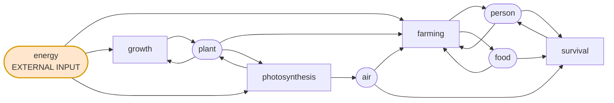
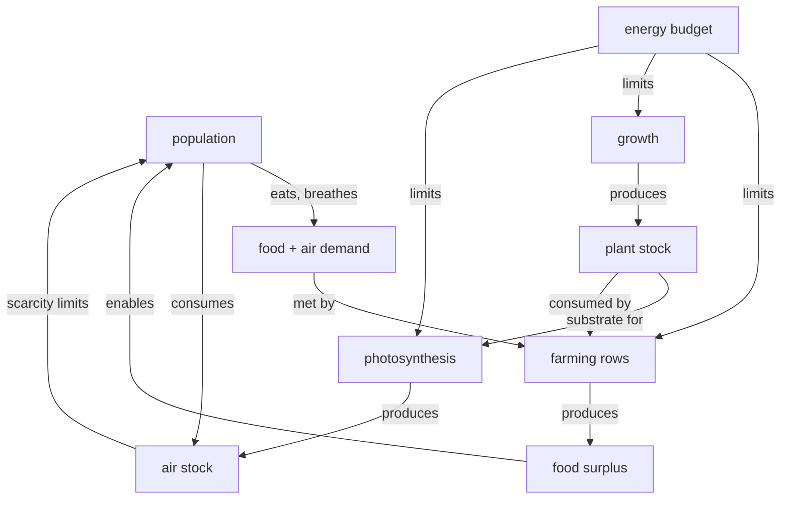

# Ecosystems & System Dynamics

*Working notes on the minimal closed-loop model: what resources we need, what the stable
state looks like, what knocks it out of stability, and what stops runaway growth. Feeds
into the GDD (§3.3 ecosystem management) and the scenario format.*

---

## 1. The minimal resource set

### Design constraint: nothing is extractive

Most builders are extractive — ore in the ground, trees on the map, a frontier to
consume. A generation ship has none of that. **Everything cycles.** There is no mining
because there is nowhere for the ore to have come from and nowhere for the tailings to
go.

**Energy is the single exception.** It is the one input that arrives from outside the
closed system (star, reactor, sail). This is also the reveal in miniature: at town scale
energy looks free and ambient, and at ship scale it is the hard budget everything else
is denominated in.

### The set

| Resource | Role |
|---|---|
| `person` | labour, and the thing whose survival is the fail condition |
| `food` | sustenance; the bottleneck that surfaces scarcity fastest |
| `plant` | biomass; the substrate for food and gas exchange |
| `air` | oxygen — a **benefit** people consume, plants produce |
| `energy` | the one open input; drives every conversion |

Five is enough for multiple interlocking loops. `waste` is a strong candidate sixth —
see §6.

**Note on `air`:** an earlier pass in this session treated air as an exhaust product that
people emit. That was wrong for this game. Air-as-oxygen — consumed by people, produced
by plants — is the correct reading: it makes the atmosphere a thing you can *run out of*,
which is the whole horror of a sealed hull. Exhaust belongs to `waste` (§6).

### What we deliberately don't model

Water, temperature, pressure, nutrients, minerals, multiple crop types, atmospheric
stratification. Energy subsumes most of them as an abstraction, and the rest are
extractive or add nodes without adding loops.

---

## 2. The transforms and the loops

Metabolism is embedded in work (a worker eats and breathes *while* working), because
under single-use rows a token does exactly one thing per turn — see
`DESIGN-CHANGES-single-use.md` §2.

```
farming:        person + food + air + plant + energy  →  person + 2 food
survival:       person + food + air                   →  person          (idle fallback)
growth:         plant + energy                        →  2 plant
photosynthesis: plant + energy                        →  plant + air
```

### Resource / transform graph



### The loops, as causal structure



Three loops worth naming:

1. **Reinforcing — population/food.** More people → more farming capacity → more food →
   more people. Unbounded on its own; braked only by the energy budget and by land
   (`plant`) competition.
2. **Balancing — atmosphere.** More people → more air consumed → air scarcity → fewer
   people survivable. Photosynthesis is the counterweight, and it competes with farming
   for both `plant` and `energy`.
3. **Balancing — energy contention.** `farming`, `growth`, and `photosynthesis` all draw
   the same finite energy. Feeding people, growing biomass, and making oxygen are in
   direct three-way competition. **This is the central tension of the model** — every
   interesting decision is an allocation among these three.

The nice property: no loop is decorative. Cut energy and all three degrade at once, in
different directions, on different lags.

---

## 3. Solving for equilibrium

### Method

Under universal decay, next turn's stock is *exactly* what fired this turn. So
equilibrium is not "flows balance" in the usual sense — it is:

> For every resource, **total emissions per turn = stock level**, and total consumption
> ≤ stock.

A *tight* equilibrium is one where consumption = emissions = stock for every resource:
nothing is idle, nothing decays unused.

Let `n_farm`, `n_surv`, `n_grow`, `n_photo` be the number of rows of each type that fire,
and `E` the external energy arriving per turn.

**Food:** emitted `2·n_farm`; consumed `n_farm + n_surv`.
→ `2·n_farm = n_farm + n_surv` → **`n_farm = n_surv`**

**Air:** emitted `n_photo`; consumed `n_farm + n_surv`.
→ **`n_photo = n_farm + n_surv`**

**Plant:** emitted `2·n_grow + n_photo`; consumed `n_farm + n_grow + n_photo`.
→ **`n_grow = n_farm`**

**Energy:** emitted `E` (nothing internal produces it); consumed `n_farm + n_grow + n_photo`.
→ **`E = n_farm + n_grow + n_photo`**

**Person:** every person token is consumed and re-emitted by whichever single row claims
it, so population is just `P = n_farm + n_surv`. Balanced by construction.

### The smallest tight equilibrium

Set `n_farm = 1`:

| | value |
|---|---|
| `n_farm` | 1 |
| `n_surv` | 1 |
| `n_grow` | 1 |
| `n_photo` | 2 |
| **rows total** | **5** |

| resource | stock |
|---|---|
| `person` | 2 |
| `food` | 2 |
| `plant` | 4 |
| `air` | 2 |
| `energy` | 4 per turn, external |

Verify consumption: person 2 ✓, food 1+1=2 ✓, plant 1+1+2=4 ✓, air 1+1=2 ✓,
energy 1+1+2=4 ✓. Every resource exactly balances.

### Three results worth keeping

**(a) Exactly half the population works.** `n_farm = n_surv` falls straight out of
farming yielding 2 food while the worker and one idler each eat 1. It is not a tuning
choice — it is forced by the recipe. Change farming's yield to 3 food and the working
fraction changes with it. *This is the same 50/50 split that motivated interleaved rows
in the order-vocabulary discussion; here it appears as an equilibrium condition rather
than a player intention.*

**(b) A tight equilibrium needs no storage rows at all.** Every unit of every resource is
consumed and re-emitted by a *production* transform each turn. Storage transforms
(`air → air`, `food + energy → food`) are only needed to hold stock **above** what the
flows carry — i.e. buffers. Storage is the cost of resilience, not the cost of existing.

**(c) Energy demand is ~2× population.** With `E = n_farm + n_grow + n_photo` and
`P = 2·n_farm`, we get `E = 4·n_farm = 2P`. Every additional person costs two energy per
turn *forever*, before any surplus. That is the number the ship-scale player is
ultimately budgeting.

### Correction to the in-session working

The first pass at this used a separate `respiration` transform (`person + food → person
+ air`) alongside farming. Under multi-use that let one person token be an input to
*both* farming and respiration in the same turn — and since both emit a person, the
population would **double every turn**. That is exactly the unintentional-longevity bug
the single-use decision exists to prevent. The transform set above folds metabolism into
work and idle, which is both correct and simpler.

---

## 4. Intentional divergence — why leave equilibrium

Equilibrium is a *floor*, not a goal. A player who finds it and sits there has a stable
village and no game. They leave it deliberately to build things equilibrium cannot
produce:

- **Control terminals.** The mechanism by which a player issues orders to a location.
  They are resources like anything else, built by a transform with real input costs, and
  they are how scope expands: to manage a location you do not yet control, you must
  generate surplus *here*, move it *there*, and stand up a terminal.
- **Cultural resources.** Movements are resources under the same decay rules (see §6 of
  `DESIGN-CHANGES-single-use.md`). Growing one costs inputs that equilibrium does not
  spare.
- **Population.** Any reproduction transform competes with work for the same person
  tokens, so growing costs a turn of labour per birth, on top of the permanent +2
  energy/turn each new person adds.

So expansion is: **deliberately run the system off-balance, in a chosen direction, at a
known cost, and hold it there long enough to bank the surplus.** The two divergence modes
are therefore not symmetric — intentional divergence is the *verb of progress*, and
unintentional divergence (§5) is the thing you survive.

---

## 5. Unintentional divergence — external shocks

The design intent is that these are **not random**. They are the visible local shadow of
decisions taken at a larger scope — another player, or the ship-scale layer, changing a
flow. From inside one village it reads as weather; from above it is policy.

### Energy reduction (the canonical shock)

`E` drops from 4 to 3. One of `farming`, `growth`, `photosynthesis` cannot fire. Priority
order decides which — and each choice fails differently:

| starved transform | first effect | cascade |
|---|---|---|
| `photosynthesis` | air stock falls | people can't run farming *or* survival → population dies from the top down |
| `growth` | plant stock falls | farming loses substrate in 1–2 turns → food fails → starvation |
| `farming` | food halves | half the population can't eat next turn → immediate, but plant/air stay intact |

Note these have **different lags** — air and food bite immediately, plant bites a turn or
two later. That is what makes the choice interesting rather than arithmetic: you are
picking which problem arrives when, and buying time to fix the upstream cause.

**Responses available:**

- *Reallocate.* Reorder rows so the scarce energy goes where the lag is longest.
- *Shrink deliberately.* Let population fall to a level the new `E` supports (`P = E/2`).
  Ugly but stable, and recoverable — "limping in is winning."
- *Substitute.* If local energy generation exists (see open questions), lean on it.
- *Import.* Draw from an upstream location via the DAG — which is what having expanded
  scope buys you.

### Energy increase

Not free. Surplus energy with no sink means rows sit idle and stock decays unused —
slack, not wealth. The shock is an **invitation to restructure**: add farming rows, add
population, build terminals. But every structure added raises the floor, so when `E`
returns to normal the crash is deeper than before. *Growth during a boom is a bet that
the boom is permanent.*

### Other shocks in the same family

- **Air influx or loss** — a hull breach, or an over-corrected life-support system.
- **Plant loss** — blight; deletes substrate directly, hits food two ways (farming input
  *and* photosynthesis input).
- **Population transfer** — people arrive or leave. Arrivals are a demand shock with no
  matching supply; departures free energy but may drop below the row count you have
  staffed.
- **Diverted flow** — an upstream location's priorities change and stops feeding you.
  Mechanically identical to a shock; politically, an act.

---

## 6. Accumulation, waste, and self-correction

### Universal decay already handles most of it

There is no "too much air fills the warehouse" problem. If you stop paying for storage
rows, the surplus is gone next turn. And because every stored unit costs a row, **storage
competes with production for list space.** That is a structural, self-scaling cap that
needs no authored number and doesn't care whether a resource is physical or abstract.

So the real problem is the inverse: **disposal is free by default.** In a sealed ship it
should not be. Nothing leaves.

### `waste` — the sixth resource

```
farming:        person + food + air + plant + energy  →  person + 2 food + waste
survival:       person + food + air                   →  person + waste
growth:         plant + energy + 2 waste              →  2 plant        (composting)
photosynthesis: plant + energy                        →  plant + air
```

Re-solving with `n_farm = 1`: waste emitted `n_farm + n_surv = 2`, consumed `2·n_grow =
2` ✓. Stocks become `person 2, food 2, plant 4, air 2, waste 2`, `E = 4`. Same five rows.

The equilibrium is unchanged in shape — but now **under-running `growth` doesn't just
slow plant production, it lets waste build.** One transform, two failure modes.

### Making accumulation cost something: autotoxicity

The systems-theory shape we want is **autotoxicity** — yeast dying in their own alcohol,
density-dependent mortality. The brake is generated *by the success itself*, so growth
carries its own limit and no cap is needed.

Three mechanisms, in rough order of machinery required:

1. **Self-perpetuation.** Waste above a threshold auto-inserts `waste → waste` rows via
   the same pre-tick controller phase that cultural resources use. Waste becomes sticky:
   it maintains itself by eating list space, and only deliberate processing removes it.
   Zero new mechanics.
2. **Contamination.** Auto-inserted `waste + food → waste` rows: the more waste you
   carry, the more food you lose per turn.
3. **Inhibition.** Productive transforms gain a waste input they consume and re-emit
   (`... + waste → ... + waste`), so waste doesn't shrink but must be *present and tied
   up*, crowding the pool.

These stack badly — all three at once makes waste overwhelming. **Pick self-perpetuation
plus a composting route back to `plant`**, so waste is a resource you must *process*
rather than a penalty you must *avoid*. That fits the closed-system thesis better than
punishment does.

### You do not fight accumulation row-by-row

An important correction to an earlier worry. If waste auto-inserts rows faster than the
player can issue removal orders, that looks like an unwinnable race — but **removal
orders are the wrong tool and the player should lose that race.** The intended play is
that you shape *systems* that consume waste: nudge toward composting, add `growth` rows,
raise the priority of transforms that eat the byproduct. You cannot out-click the
accumulation; you can out-design it.

This generalises: **the player's lever is the shape of the transform stack, never the
individual unit.** Good.

### Disease — threshold effects and a resource that spreads

Waste should not be lethal at normal levels — people generate it constantly just by
living. Penalise *excess* only, via a threshold recipe:

```
plague: person + 5 waste  →  5 waste        (person consumed, not re-emitted → dies)
```

The 5-waste requirement means it simply cannot fire in a healthy village. It is a cliff,
not a slope — which gives the player a visible warning band before anything dies.

**The stronger idea: disease as a resource.** Because it is a resource, everything the
engine already does applies for free:

```
outbreak:  5 waste            →  disease              (filth breeds it)
contagion: person + disease   →  2 disease            (a person is consumed; it doubles)
medicine:  person + disease + energy  →  person       (treatment, costs labour and power)
```

Disease then **reproduces** (a reinforcing loop with the population as its substrate),
**decays** if not sustained (universal decay does the work — no recovery rule needed),
and **travels down the location DAG exactly like cultural resources do.** An epidemic
spreading from settlement to settlement, and quarantine being a matter of managing DAG
edges, both fall out of mechanisms that already exist.

That is the strongest argument that the resource/transform substrate is the right one:
epidemiology arrived without a single new mechanic.

---

## 7. Principles

1. **Nothing is extractive except energy.** Every other resource must be produced by some
   transform in the closed loop. If a design asks for a new raw input, that is a signal
   the loop is incomplete, not that a new resource is needed.
2. **Every interesting decision is an allocation, not an acquisition.** `farming`,
   `growth`, and `photosynthesis` contending for one energy budget is the engine of play.
3. **Equilibrium is a floor, not a goal.** The game is what you do with deliberate
   surplus, and what you do when someone else takes it away.
4. **Shocks are decisions at another scale.** Prefer external pressure that is another
   player's or another layer's choice over random events. Same mechanics, far better
   story.
5. **Different failure lags are the source of tension.** When shocks force a choice,
   make the options fail on *different timescales*, not at different magnitudes. Picking
   which problem arrives when is a decision; picking a smaller number is not.
6. **Limits should be autotoxic, not authored.** Prefer brakes generated by the growth
   itself (waste, disease, crowding) over caps. Storage-competes-for-rows is already one
   such brake and should be leaned on before any new one is added.
7. **Storage is the cost of resilience.** A tight equilibrium needs no buffers; buffers
   are what you pay for to survive shocks. That trade should stay legible.
8. **The player shapes systems, never units.** Any failure mode that can only be answered
   by repetitive per-unit orders is designed wrong. The answer should always be
   restructuring the stack.
9. **Prefer new resources over new mechanics.** Disease as a resource gets spread,
   decay, and transmission for free. Ask "can this be a resource?" before adding a rule.
10. **Waste is processed, not avoided.** Byproducts should be inputs to something. A
    dead-end byproduct is a punishment; a recycled one is a puzzle.

---

## 8. Open questions

Each carries a provisional answer, so nothing here blocks implementation.

**8.1 Does anything generate energy locally?**
As modelled, no — energy is purely external, which is thematically clean but leaves the
player without a supply-side response to an energy shock.
*Provisional:* add a lossy secondary route (`biomass: plant + waste → energy`, low yield)
so that leaning on it is possible but expensive, and it visibly trades against food.
Keeps "energy is the open input" true at ship scale while giving the town-scale player a
lever.

**8.2 What is the reproduction transform?**
Not yet specified, but population growth is required for any expansion story.
*Provisional:* `person + person + food + air + energy → person + person + child`, with
`child → person` as a maturation row next turn. Costs two workers a full turn, so growth
genuinely competes with production. Age stages beyond `child` stay deferred.

**8.3 Where do control terminals sit in the recipe graph?**
*Provisional:* a `terminal` resource built by a transform consuming surplus food, plant,
and energy, requiring a `person` for several turns. It must also be *maintained* (a
storage row with an energy cost) so that expanded scope has an ongoing price and can be
lost.

**8.4 What exactly triggers auto-inserted rows?**
Threshold-on-aggregate is the assumed shape (waste above N → insert a row).
*Provisional:* threshold triggers only, at most one row inserted per controller per turn,
every insertion logged to the replay as an event. Continuous/proportional triggers are
deferred until something demands them.

**8.5 How does `waste` interact with the DAG?**
Resources flow downstream, so a downstream settlement inherits upstream waste along with
upstream food.
*Provisional:* let it. "Downstream of the farms" being a worse place to live is good
emergent geography, and it makes evaluation order (ISSUES #2) a live design lever rather
than a bug.

**8.6 Air as a slow variable?**
Air currently equilibrates turn-to-turn, so atmospheric collapse is as fast as food
collapse. Thematically it should be the slowest, most ominous variable.
*Provisional:* give air a large buffer via cheap storage rows (`air → air`, no energy
cost) so that a location holds many turns of atmosphere. Then air failure is a slow leak
the player watches approach, which is exactly the tone the GDD asks for.

**8.7 Do the equilibrium numbers survive contact with the engine?**
The §3 solve is by hand.
*Provisional:* encode it as a test — build the scenario, run 50 turns, assert the stock
matrix is unchanged. A drifting "equilibrium" is a bug in either the model or the engine,
and it is worth knowing which. This also gives issue #1 (the tick-5 collapse) a target
to be rebalanced *towards*.
